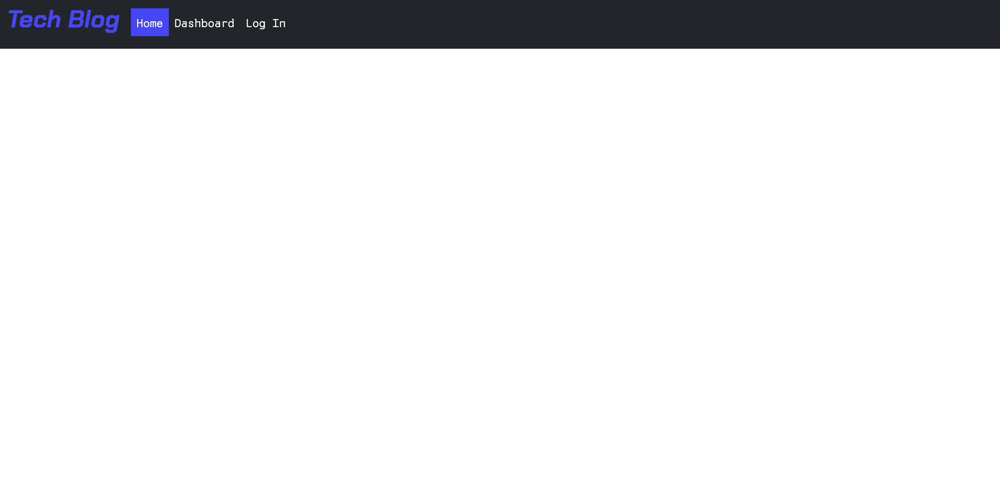

# Tech-Blog

## Description

I have created a tech blog where developers can publish their blog posts and comment on other developers’ posts.

## Table of Contents

  - [Installation](#installation)
  - [Usage](#usage)
 - [Credits](#credits)

## Installation

No installation necessary. You can view the application at: https://my-tech-blog-2023-238a1416fbe6.herokuapp.com/

## Usage

When the user loads the web application they are brought the homepage. Here they will see any blog posts that have sumbitted to the blog. They will be able to see both the title of the post and the contents of the post. 

If there are no posts submitted at the time, the homepage will be blank.

At the top of the page the user will see a navbar where they can navigate to and from the homepage, dashboard and login page.

When clicking on login the user is redirected to a page with a login form,

if the user does not have an account then the they can click 'sign up' to be redirected to a sign up form.

If there are posts on the homepage, a user can click on the title of one and it will bring the user to a page with that post and show all comments attached to the post. There will also be a form at the bottom to add a new comment. Users can view the homepage and post details without being logged in but will need to be logged in in order to create a comment.

On the dashboard the user will be able to see all the posts they have made along with a button to add a post. (The user is only able to see the dashboard when they are logged in. If they are not logged in then they will be redirected to the login page.)

The user can click on the title of any of their posts which will bring up a form where they can wither update their post or delete their post.

## Credits

Used AskBcS for help with understanding logging in and how to save information to the session.
